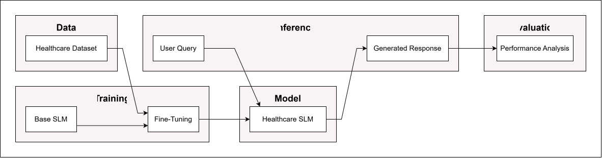
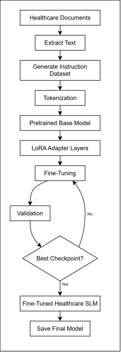

# AI Sarthi

AI Sarthi is an AI-powered Healthcare Assistant designed for the Indian healthcare system. It leverages a fine-tuned Small Language Model (SLM) backed by a Retrieval-Augmented Generation (RAG) pipeline to provide accurate, evidence-based answers to healthcare policy and medical queries.

--------------------------------------------------
## 1. PROJECT OVERVIEW
--------------------------------------------------

AI Sarthi aims to solve the challenge of navigating complex healthcare documentation. By combining the conversational capabilities of a fine-tuned Phi-3 Mini model with a robust RAG pipeline, it ensures that answers are not hallucinated but firmly grounded in verified healthcare reports and policies.

- **Why RAG?** Medical and policy information changes rapidly and requires high factual accuracy. RAG anchors the language model's responses to retrieved facts.
- **Why an SLM?** Small Language Models like Phi-3 Mini are efficient, can run on local hardware, and can be fine-tuned via QLoRA to understand specific domains deeply without the overhead of massive LLMs.
- **What it does:** The chatbot processes user questions, retrieves the top relevant context from ingested documents, and generates a clean, cited response.

--------------------------------------------------
## 2. KEY FEATURES
--------------------------------------------------

- **Healthcare Document Ingestion:** Processes PDFs and CSVs into clean, searchable chunks.
- **ChromaDB Vector Store:** Highly efficient local semantic retrieval using `BAAI/bge-small-en-v1.5` embeddings.
- **Fine-Tuned SLM:** Customized PyTorch LoRA adapter for Phi-3 Mini, trained specifically on healthcare instructions.
- **Citation-Backed Responses:** Automatically extracts and presents source metadata alongside generated answers.
- **Streamlit Chatbot:** A professional, interactive, session-aware frontend UI.
- **Evaluation Framework:** Built-in benchmarking suite to evaluate latency, generation quality, and retrieval accuracy.

--------------------------------------------------
## 3 SYSTEM ARCHITECTURE
--------------------------------------------------

### 3.1 Proposed Architecture
<p align="center">
  
</p>

---
### 3.2 System Architecture
<p align="center">
  
</p>

---

### 3.3 Fine-Tuning Architecture

<p align="center">
  
</p>


--------------------------------------------------
## 4. PROJECT STRUCTURE
--------------------------------------------------
- `app/`: Streamlit web interface and chat service wrapper.
- `src/`: Core logic (RAG pipeline, retrieval, embeddings, dataset prep, evaluation).
- `scripts/`: Executable entry points (Training, Evaluation).
- `data/`: Raw and processed datasets.
- `models/`: Fine-tuned PyTorch checkpoints and LoRA adapters.
- `vector_store/`: Persistent ChromaDB database.
- `docs/`: In-depth architectural and development documentation.

--------------------------------------------------
## 5. INSTALLATION
--------------------------------------------------

1. **Clone the repository:**
   ```bash
   git clone https://github.com/vedant-bitbyte/healthcare-ai.git
   cd healthcare-ai
   ```

2. **Set up the virtual environment:**
   ```bash
   python -m venv venv
   source venv/Scripts/activate  # On Windows
   ```

3. **Install dependencies:**
   ```bash
   pip install -r requirements.txt
   ```

4. **Environment Variables:**
   Copy `.env.example` to `.env` and adjust paths if necessary.

--------------------------------------------------
## 6. RUNNING THE APPLICATION
--------------------------------------------------

**Start the Streamlit Chatbot:**
```bash
streamlit run app/app.py
```

**Run Model Evaluation CLI:**
```bash
python scripts/evaluate_model.py --model "fine-tuned"
```

--------------------------------------------------
## 7. DATA PREPARATION & TRAINING FROM SCRATCH
--------------------------------------------------
To reproduce the fine-tuning dataset, embeddings, and QLoRA training from scratch, execute the following pipeline in order:

### 1. Document Ingestion
Place your raw healthcare PDFs or CSVs into `data/raw/`. Then run the ingestion pipeline to extract and chunk the text into `data/processed/`.
```bash
python -m src.ingestion.pipeline
```

### 2. Build ChromaDB Vector Store
Index the processed chunks into the local ChromaDB vector database so they can be retrieved by the RAG system.
```bash
python -c "from src.vectorstore.chromadb_store import VectorStore; VectorStore().index_chunks_directory()"
```

### 3. Generate Instruction Dataset
Generate synthetic QA pairs from the chunked documents for fine-tuning.
```bash
python scripts/generate_instruction_dataset.py
```
*(This produces `instruction_train.jsonl`, `instruction_validation.jsonl`, and `instruction_test.jsonl` in the `output/` folder).*

### 4. Rewrite and Clean Dataset (Optional but recommended)
Use a local Ollama model to refine and clean the synthetically generated QA pairs.
```bash
python scripts/rewrite_dataset.py --input output/instruction_train.jsonl --output output/train_clean.jsonl
python scripts/rewrite_dataset.py --input output/instruction_validation.jsonl --output output/validation_clean.jsonl
python scripts/rewrite_dataset.py --input output/instruction_test.jsonl --output output/test_clean.jsonl
```

### 5. Convert to Chat Format
Format the cleaned instructions into the conversational Phi-3 multi-turn chat template.
```bash
python scripts/convert_to_chat.py --train output/train_clean.jsonl --val output/validation_clean.jsonl --test output/test_clean.jsonl --outdir data/chat
```

### 6. Run QLoRA Fine-Tuning
Start the PyTorch training loop to fine-tune the Phi-3 Mini model on your prepared healthcare dataset.
```bash
python scripts/train_phi3.py
```
*Note: The trained LoRA adapter weights will be saved directly to `models/outputs/` where the Streamlit application will automatically pick them up during startup!*